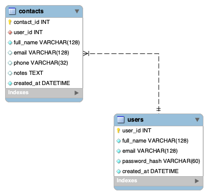

## Small Project - Contact Manager

This project is a full-stack Contact Manager application built for COP4331.

Users can register, log in, and manage a personal list of contacts. Each authenticated user can create, view, update, delete, and search contacts stored in a relational database.

The backend is implemented in PHP using Slim Framework and exposes REST API endpoints for user authentication and contact management. The frontend is built with HTML, CSS, and vanilla JavaScript, communicating with the backend using the Fetch API.

Swagger (OpenAPI) is used to document the API. An ERD was created to design the database schema, and a Gantt chart was used to track project progress.

So far, we have completed the database design using an ERD, implemented the backend REST API with Slim Framework, added user authentication and contact CRUD functionality, integrated the frontend with the backend using Fetch API, and documented the API using Swagger. We also created a Gantt chart to organize development phases and added basic API testing to validate endpoints. The application currently supports user registration, login, contact creation, retrieval, updates, deletion, and search.

The goal of this project is to build a simple full-stack contact management system while practicing REST API development, frontend–backend integration, database design, and team collaboration. The backend was built using PHP, the frontend using HTML, CSS, and JavaScript, and the database was designed with an ERD and accessed through the API. Swagger (OpenAPI) was used for API documentation, GitHub for version control, and Google Sheets for project timeline management.

### Running the project

- Install PHP
- Install Composer

> cd backend

> composer i

> composer dump-autoload

> php -S 127.0.0.1:8000 router.php

### API Routes

Base path: /api

GET /api/health  
Returns API status.

POST /api/users/register  
Creates a new user.

POST /api/users/login  
Authenticates a user and returns user_id.

GET /api/contacts?user_id={id}  
Returns all contacts for a user.

POST /api/contacts  
Creates a new contact.

PATCH /api/contacts/{contact_id}  
Updates one or more fields of a contact.

PUT /api/contacts/{contact_id}  
Replaces the entire contact record.

DELETE /api/contacts/{contact_id}  
Deletes a contact.

GET /api/contacts/search/{query}?user_id={id}  
Searches contacts by name, email, phone.

### Gantt Chart

The project timeline was organized using a Gantt chart to visualize planning, database design, backend development, frontend implementation, documentation, testing, deployment, and presentation preparation. The chart shows overlapping phases and development progress throughout the semester.

[Gantt Chart (PDF)](Gantt%20Chart.pdf)

### ERD

The database schema was designed using an Entity Relationship Diagram (ERD) to define the Users and Contacts tables and their one-to-many relationship.

### Application Screenshots

Below are screenshots from the running application showing user authentication and contact management functionality.

#### Login Page

#### Contacts Page
